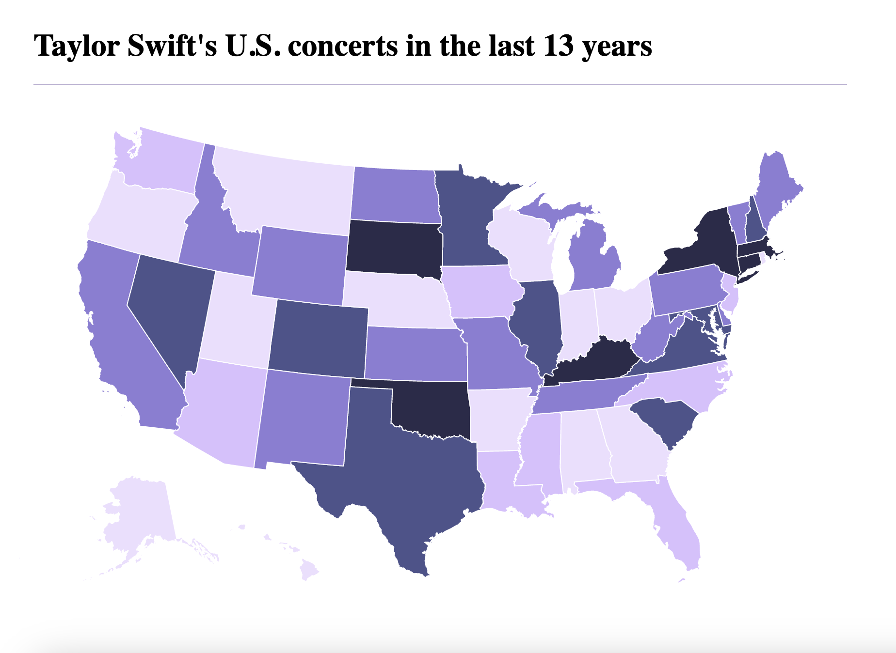

# Building a Map Component using the module d3-geo from the D3.js library

This repository shows and explains though a simple example of how to build a map in a site using some modules from the D3.js library that is used for Data Visualizations.

## Table of Contents

1. What is D3.js
2. Working with this project
3. Using and explaning the project and how to use the d3 module to build maps.

## What is D3.js

It's a Javascript library created by Mike Bostock that is used to visualize complex data with Web Standards. This means, D3 uses existing standards such HTML, CSS and SVG to visualize this data.

D3 has modules to visualize data in different ways, in this example we are using the D3 Geo module, that is used to represent maps as svg (or canvas).

## Working with this project.

To work with this project, first you'll need to have a version of `Node >= 14`. Then run `npm install` to install all of the dependencies.

To run the project just use this command `npm run start`.

This will open you a window in your browser, that will display the following map:



## Using and explaning the project and how to use the d3 module to build maps.
As it was mentioned before, we are using the d3-geo module. To use it in any project, you just have to install it.

If you are using npm, run `npm install d3-geo`, or if you are using yarn, run `yarn add d3-geo`.

Then, you will have to import it in your js file:

```
  import { geoAlbersUsa, geoPath } from "d3-geo";
```

